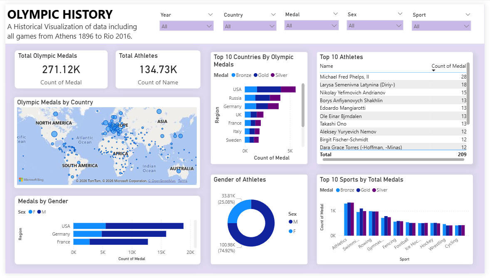

# Olympic_Dashboard
Power BI dashboard showing 120 years of Olympic history.
# Olympics History Power BI Dashboard

## Project Overview

This project presents an interactive **Power BI dashboard analyzing 120 years of Olympic Games history**.
The dashboard explores athlete participation, medal distribution, sports dominance, and country performance.

The dataset used contains historical Olympic athlete and medal data.

---

## Dataset

Dataset Source: Kaggle – *120 Years of Olympic History: Athletes and Results*
https://www.kaggle.com/datasets/heesoo37/120-years-of-olympic-history-athletes-and-results

Main dataset used:

* athlete_events.csv
* noc_regions.csv

---

## Dashboard Features

The dashboard includes the following visuals:

* **Total Athletes** – overall participation in Olympic history
* **Total Medals** – number of medals awarded
* **Total Sports** – sports included in the Olympics
* **Top 10 Countries by Medals**
* **Top 10 Sports by Medal Count**
* **Top Athletes by Medal Wins**
* **Medal Distribution by Gender**
* **Athletes by Gender**
* **Olympic Medal Map by Country**

Interactive filters include:

* Year slicer
* Country Slicer
* Medal Slicer
* Sex Slicer
* Sport Slicer
* Cross-filtering between visuals

---

## Dashboard Preview

---

## Tools Used

* Power BI Desktop
* Data cleaning using Power Query
* Data visualization techniques
* Kaggle dataset

---

## Key Insights

* Certain countries dominate Olympic medal counts historically.
* Some sports consistently produce the highest medal totals.
* Male participation historically exceeded female participation, but the gap has narrowed over time.
* A small number of elite athletes dominate total medal counts.

---

## How to Use

1. Download the **Olympic_Dashboard.pbix** file
2. Open it in **Power BI Desktop**
3. Interact with filters and visuals
